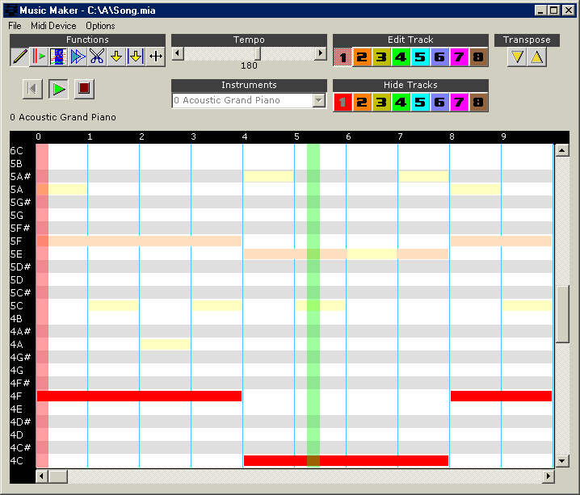



## Music Maker \(now makes \*\.mid files\!\)

### Description

Music Maker is a music editor you can use to create your own midi music. I've made several improvements since the last version but the most notable is that you can now export your music to a standard Midi (*.mid) file. I've also included a help document that will teach you how to use it if you have any problems. As always, I really appreciate any comments you might have, and of course, votes! :) Thank you!
 
### More Info
 

             |
---                |---
**Submitted On**   |2001-09-08 02:57:28
**By**             |[Jeremiah Hughes](https://github.com/Planet-Source-Code/PSCIndex/blob/master/ByAuthor/jeremiah-hughes.md)
**Level**          |Advanced
**User Rating**    |4.8 (168 globes from 35 users)
**Compatibility**  |VB 6\.0
**Category**       |[Sound/MP3](https://github.com/Planet-Source-Code/PSCIndex/blob/master/ByCategory/sound-mp3__1-45.md)
**World**          |[Visual Basic](https://github.com/Planet-Source-Code/PSCIndex/blob/master/ByWorld/visual-basic.md)
**Archive File**   |[Music Make26111982001\.zip](https://github.com/Planet-Source-Code/jeremiah-hughes-music-maker-now-makes-mid-files__1-26960/archive/master.zip)

